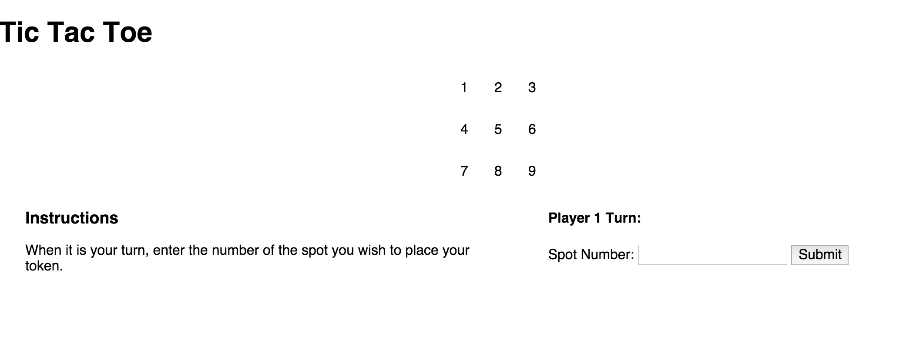

# Tic-Tac-Toe

## Simple Sinatra Tic-Tac-Toe App

###To-Do
* Make custom board size. (Or at least have an easy, medium & hard level)
* Basically redo all views to accomodate various sizes
* Split up classes (Board & Player)
* Make view look more like a tic-tac-toe board & choose space by clicking on it
* Have alert messages if you try to select a space that's already filled